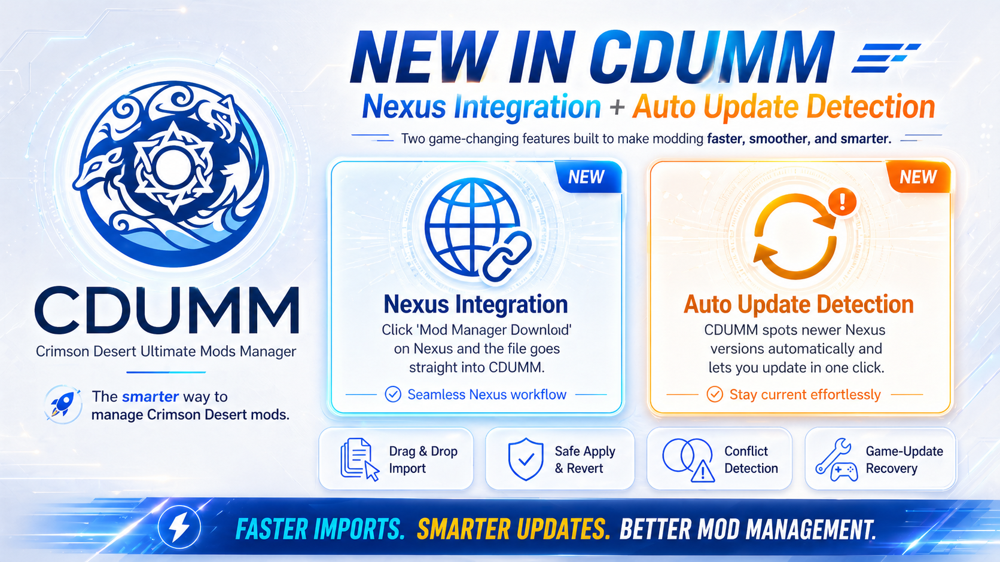

<![CDATA[<p align="center">
  
</p>

<p align="center">
  <b>The only mod manager you need for Crimson Desert.</b><br>
  Every format. Every platform. One click.
</p>

<p align="center">
  <a href="https://github.com/faisalkindi/CrimsonDesert-UltimateModsManager/releases/latest"></a>
  <a href="https://ko-fi.com/kindiboy"></a>
  
</p>

---

## How It Works

Your original game files are **never modified**. Mods are applied through an overlay directory. Reverting is instant.

1. Download **CDUMM3.exe** and run it — no install needed
2. Welcome wizard guides you through language, theme, and game folder setup
3. Drop mods onto the window — drop many at once for fast batch import
4. Click **Apply**

> If something goes wrong, click **Fix Everything** to restore clean state.

---

## Supported Formats

| Format | Description |
|--------|-------------|
| `.zip` / `.7z` / `.rar` | Archives — auto-extracted and detected |
| Folders | Loose directories with PAZ/PAMT files or Crimson Browser mods |
| `.json` | JSON byte-patch mods (compatible with JSON Mod Manager) |
| `.dds` | DDS texture mods with full PATHC index registration |
| `OG_*.xml` | XML full replacement mods |
| `.asi` | ASI plugins — auto-detected, installed to `bin64/` |
| `.bnk` | Wwise soundbank mods |
| `.bat` / `.py` | Script installers — runs in console, captures changes |
| `.bsdiff` / `.xdelta` | Binary patches |
| Mixed archives | ZIPs with ASI + PAZ content — auto-separated |

---

## Key Features

### Performance
- **Batch import** — drop dozens of mods at once, single-process import
- **Fast apply** — overlay cache + Rust native engine, applies in seconds
- **34 MB exe** — optimized build, no bloat

### Mod Management
- **Entry-level composition** — multiple mods safely modify the same PAZ file
- **Semantic merging** — field-level diffing for 322 PABGB data table schemas
- **Conflict detection** — see exactly what overlaps and why
- **Override mode** — mod authors can declare conflict winners in `modinfo.json`
- **Load order** — drag-and-drop reordering with folder groups
- **Configurable mods** — preset picker for multi-variant mods, per-patch toggle

### Game Integration
- **Auto-detection** — finds your game on Steam, Epic Games, or Xbox Game Pass
- **Update detection** — flags outdated mods after game patches
- **ASI management** — full plugin page with version tracking, enable/disable, config editing
- **Launch game** — start Crimson Desert directly from the manager

### Interface
- **Card-based UI** — Fluent Design with drag-reorder and folder groups
- **Welcome wizard** — guided first-time setup with store logos
- **Light & Dark themes** — choose during setup or switch anytime
- **16 languages** — English, Deutsch, Español, Français, 한국어, 日本語, 简体中文, 繁體中文, العربية, Italiano, Polski, Русский, Türkçe, Українська, Bahasa Indonesia, Português

### Safety
- **Apply preview** — see what changes before modifying anything
- **Verify game state** — scan all files, see vanilla vs modded
- **One-click revert** — restores all files including PATHC and PAMTs
- **Crash recovery** — atomic commits with `.pre-apply` markers
- **Find Problem Mod** — delta debugging wizard finds which mod crashes the game

---

## Installation

### Standalone Executable (Recommended)

Download `CDUMM3.exe` from the [Releases](https://github.com/faisalkindi/CrimsonDesert-UltimateModsManager/releases) page. No Python required. Just run it.

### Run from Source

Requires Python 3.10+.

```bash
git clone https://github.com/faisalkindi/CrimsonDesert-UltimateModsManager.git
cd CrimsonDesert-UltimateModsManager
pip install -e .
py -3 -m cdumm.main
```

### Building the Executable

```bash
pip install pyinstaller
pyinstaller cdumm.spec --noconfirm
# Output: dist/CDUMM.exe — rename to CDUMM3.exe for distribution
```

---

## Requirements

- Windows 10/11
- Crimson Desert (Steam, Epic Games Store, or Xbox Game Pass)

---

## For Mod Authors

CDUMM supports these fields in `modinfo.json`:

```json
{
  "name": "My Mod",
  "version": "1.0",
  "author": "You",
  "description": "What it does",
  "conflict_mode": "override",
  "target_language": "ko"
}
```

- `conflict_mode: "override"` — your mod always wins conflicts regardless of load order
- `target_language` — marks the mod as a language/localization mod, shows a badge

JSON patches support `editable_value` metadata for inline value editing in the config panel.

---

## Credits

- **Lazorr** — PAZ parsing and repacking tools
- **PhorgeForge** — JSON byte-patch mod format
- **993499094** — PATHC texture format reference
- **callmeslinkycd** — Crimson Desert PATHC Tool
- **p1xel8ted** — Performance analysis
- **HaZt** — German translation

---

## Support

If CDUMM saves you time, consider supporting development:

[](https://ko-fi.com/kindiboy)

## License

MIT
]]>