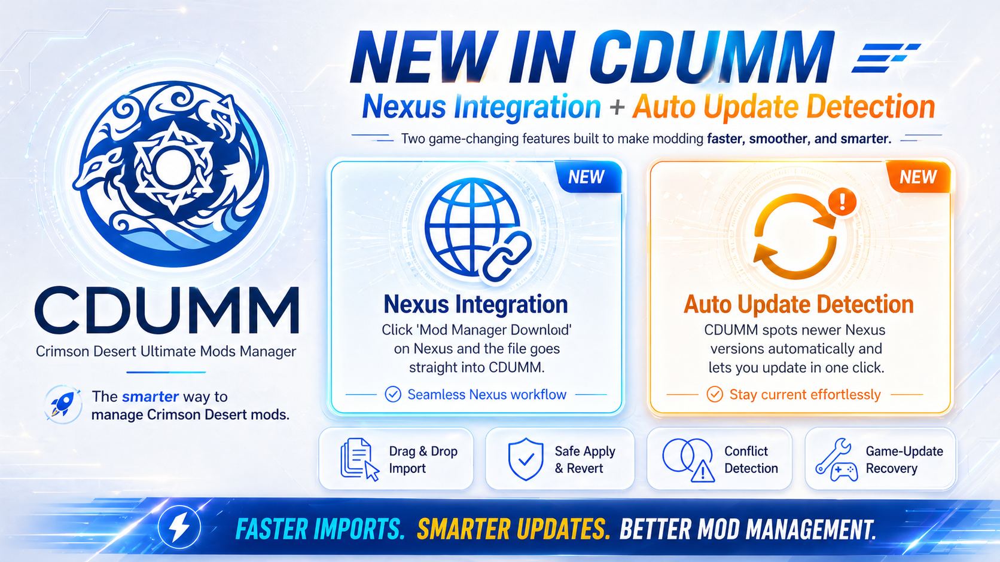

<p align="center">
  
</p>

<p align="center">
  <b>The only mod manager you need for Crimson Desert.</b><br>
  Every mod format. Every store (Steam, Epic, Xbox). One click.
</p>

<p align="center">
  <a href="https://github.com/faisalkindi/CrimsonDesert-UltimateModsManager/releases/latest"></a>
  <a href="https://ko-fi.com/kindiboy"></a>
  
</p>

---

## What's New

CDUMM ships frequent updates. The complete version history — every release back to the first commit — is in **[CHANGELOG.md](CHANGELOG.md)**; the [Releases](https://github.com/faisalkindi/CrimsonDesert-UltimateModsManager/releases) page has full notes and downloads (the in-app updater shows them too). Recent highlights, newest first:

### v3.17 — the 4 September game update

- **v3.17.6** — _September 11, 2026_ — **Mods that quietly skipped part of their changes now say so.** On the tables CDUMM rebuilds whole, a change the rebuild does not handle falls through to a second path, and a refusal there used to be thrown away: nothing written, nothing said. Those refusals now reach you as a warning after Apply. Which changes apply has not altered, only whether you are told when one does not.
- **v3.17.5** — _September 9, 2026_ — **A launch failure caused by the "Run as administrator" flag now says so instead of blaming Steam.** Windows refuses to let CDUMM start an exe with that flag set, and CDUMM reported it as Steam being unreachable, which made all three launch methods fail identically with no clue why. The message now names the flag and where to clear it. Reported by **ombre03**. (#415)
- **v3.17.4** — _September 8, 2026_ — **The Stage table no longer shows numbers it cannot stand behind.** Its layout came from an outside parser and the game's own loader reads it differently: three fields the layout does not list, and one read as eight bytes where the layout says four. Everything past the fifth field was lined up wrong, so 76 columns looked real and were not, and a mod could write to them and hit the wrong byte. Those now read *(unverified)* and refuse writes. No other table is affected. (#409)
- **v3.17.3** — _September 8, 2026_ — **Two data tables showed two of their values under the wrong names.** The quest gauge table had the completion percentage and the gauge timer swapped, and the AI event table had the interrupt flag and the delay type swapped, both mapped from the game code in August by a tool with an ordering bug. The usual check could not catch it because the fields are the same total size either way, so the table still read cleanly with them swapped. It surfaced as a percentage of 1113255523123200 and a yes/no flag valued 2. Corrected and confirmed three ways. (#409)
- **v3.17.2** — _September 7, 2026_ — **Item mods apply to 392 more items.** The 4 September update added four bytes inside 392 item records, all the same kind of equipment entry, and CDUMM could no longer read them: a mod touching one applied nothing, with no error and no warning. Nothing was ever damaged; the items simply stopped being editable. They read and apply normally again, and the previous game version is unaffected. Spotted by **Gleb Kogtev**. (#405)
- **v3.17.1** — _September 6, 2026_ — **Inspect Mod no longer calls a working mod unsupported.** Its report said "No recognized mod format detected" for any mod editing more than one game table, while importing the same file worked fine. It now uses the importer's own reader and lists every table the mod touches with its change count. Reported by **woowoots**. (#400)
- **v3.17.0** — _September 6, 2026_ — **Mods work again after the 4 September update.** That patch renamed every game data table (`iteminfo.pabgb` is now `iteminfo.staticinfobody`) and no mod on Nexus uses the new name, so CDUMM found no target files at all: imports were rejected and Apply changed nothing while blaming your mods. Both namings are now the same file. The same update also added eight bytes to every shop stock record, which pushed CDUMM onto the wrong reading and silently dropped 16 of 17 stores in Shop Smart, so shops opened empty; the new layout is derived and pinned, and an unrecognised build is now refused outright instead of mis-read. Also: switching off a mod whose patches were all skipped no longer wedges Apply. Fixes by **Gleb Kogtev**, reported by **woowoots** and **delichandelarosse**. (#400, #393)

### v3.16 — the 26 August game update (2.0)

- **v3.16.7** — _September 2, 2026_ — **Rescan then Apply no longer leaves the game unable to start.** Rescan deleted leftover mod folders but left them in the game's archive index, the snapshot recorded that, and every Apply restored the dead entry until the game refused to launch. Rescan cleans the index first now; Apply never resurrects an entry for a missing folder. **Linux / Steam Deck: CDUMM starts under any Wine/Proton version** (ICU bundled). (#393, #398)
- **v3.16.6** — _September 1, 2026_ — **Expanded Vendor Inventory Rebuilt V3 applies** (with its Dye Addon and Bran's Specialty Store). It uses DMM's add-to-list operation, which CDUMM now accepts, and needed shops to gain stock records and per-slot edits, Dyers to gain colour groups and texture sets, and the dye colour group table to be writable. Verified on 2.00.01: all 3,619 shop edits, 2,128 price edits and 400 colour additions land byte-exact. (#191)
- **v3.16.5** — _August 31, 2026_ — **CDUMM no longer deletes your installed language packs.** 2.0's new voice packs download into the game's five reserved slots (0036 to 0040); CDUMM treated anything there as a mod folder and removed it on the first scan or a Rescan, silently dropping the game back to English. Those slots are now recognised as Steam-owned. If a language already went missing, one Steam file verify brings it back. (#395)
- **v3.16.4** — _August 31, 2026_ — **Dye Hard and Greylight Special apply.** Dye Hard edits two dye lists on each world Dyer's NPC record and CDUMM had no writer for that table; it does now, with the layout proven against the Camp Dyer's own record. Greylight Special's bond and contribution shops now take copper as intended (the store purchase-currency field is pinned across all 436 stores). Shop Smart and Refined Life already applied in full. (#393)
- **v3.16.3** — _August 29, 2026_ — **No more false "5 issues that may crash the game" after every Apply on 2.0.** The post-apply check was flagging the game's five reserved language-pack slots (0036 to 0040) as missing folders; they are supposed to have none. **Rescan no longer sits on "Initiating rescan..." forever.** **Linux / Steam Deck / Bazzite: CDUMM finds the game under Proton or Wine** and its folder picker can enter hidden folders like `.local`, so a Steam library under `/home` is reachable. (#390, #376, #386)
- **v3.16.2** — _August 26, 2026_ — **Interrupted imports no longer leave gigabytes behind.** A crashed or force-closed import left its extracted archive under `CDMods/_import_staging/`; one user had 25 GB of leftovers. Swept automatically at startup now. (#371)
- **v3.16.1** — _August 26, 2026_ — **Mods actually load in game on 2.0.** The update added five reserved slots (0036 to 0040) to the game's archive index with no folder on disk. CDUMM mistook four of them for leftover mod folders and deleted them from the index on every Apply, and parked its own overlay in the fifth, which the game treats as a not-installed language pack and never loads. Apply reported success and verified clean while not one mod had any effect. Overlays now go in slot 0041 and up, the reserved slots are left alone, and a damaged index repairs itself on the next Apply. (#383)
- **v3.16.0** — _August 26, 2026_ — **Item mods work again on 2.0.** The update changed the item table's layout and CDUMM could not read one of its 6,810 records, so every item mod applied nothing. **Reset and Rescan work on 2.0** (a version check was pinned to the old file count). **Disabling all mods actually removes them** (leftover overlay data used to stay on disk and crash the game after an update). **"Check for Mod Updates" says what it checked** instead of reporting "all up to date" when nothing was checkable. Four of these fixes by Gleb Kogtev. (#377, #372 to #375, #379)

### v3.15 — item prices, store stock, more tables

- **v3.15.1** — _August 24, 2026_ — **Store mods no longer apply only part of their edits.** Changing an item a store already sold silently wrote the vanilla values back; fixed by Gleb Kogtev.
- **v3.15.0** — _August 20, 2026_ — **Item price mods work again** after the August 15 update added four bytes to part of the item table (5,548 of 6,573 items had fallen into a two-field fallback that accepted price edits and wrote nothing). **Store mods can add stock again.** Mods that identify a record by number alone now import. The Game Data grid says when it cannot read a table. **55 of the game's tables are readable.** Fixes by Gleb Kogtev and AgentKush. (#365, #367)

### v3.14 — 53 tables readable

- **v3.14.0** — _August 13, 2026_ — **CDUMM reads 53 of the game's data tables, up from 29**, each held to the exact-tiling rule. Two v3.13 layouts that only fitted by coincidence were withdrawn. Derivation work by AgentKush. (#362, #364)

### v3.13 — 22 more of the game's tables readable

- **v3.13.0** — _August 12, 2026_ — **CDUMM reads 22 more of the game's data tables, taking it from 7 to 29.** Their layouts were worked out from the game's own code and then held to a hard rule before being accepted: the walk has to account for **every byte of every record** in the table, and no other layout the format allows may fit it as well. A walk that reaches the last field with bytes left over hasn't understood the record, it's just stopped politely, so anything short of an exact fit was thrown away rather than shipped. Getting there needed a real bug fixed first: every record starts with an id, how many bytes that id takes varies by table, and CDUMM was deciding with a rule that only held for the two commonest widths — so on the rest it read the id too wide and swallowed the front of the record with it. Five tables went from **no** readable entry names to all of them (`mercenaryinfo` 21/21, `mercenarygroupinfo` 11/11, `socketinfo` 2/2, `autospawnfilterinfo` 1/1, `gamestartinfo` 1/1), and the character appearance index stopped reading its 3,508 records as nonsense. These 22 are **readable, not yet editable** — the proof pins down where each field sits, not what it means, and CDUMM won't offer you a value to change until the meaning is checked too. (#360)

### v3.12 — skill mods, Character Creator & status groups

- **v3.12.0** — _August 11, 2026_ — **Skill mods work again.** The August update added one byte to every record in the game's skill table, and CDUMM could no longer read 589 of its 2,013 entries. The part that wasn't visible is worse: the entries it *could* read were being read one byte too far in, so the first half of every skill was wrong while nothing looked wrong — it reported success, and the file it wrote back matched byte for byte, because it was faithfully writing back what it had misread. All 2,013 read correctly now, and CDUMM works out which layout your game uses rather than assuming one. **Character Creator's Female Animations starts the game again** — the character's gender value was being written to the wrong place, so the part of the mod that switches the character over never happened and an unrelated slot got overwritten instead; this mod had never once worked in CDUMM, on any version. **Status-group mods apply again** — the writer was checking the table against a count that was correct when it was written and isn't now, so it refused every record and reported a layout error when there was nothing wrong with the table; it now measures that count from the file. (#355, #302, #356)

### v3.11 — security hardening

- **v3.11.0** — _August 9, 2026_ — **Entirely security hardening.** No mod that works today behaves any differently, and neither problem was reported happening to anyone — both needed a mod built deliberately to abuse them. They were fixed anyway, because a mod manager's whole job is opening files written by strangers. **A mod can no longer smuggle extra commands past you when CDUMM runs its script**: the command was handed to the Windows shell as a line of text, so anything the shell treats as punctuation inside a file name was read as a further instruction; scripts now start directly and the shell never gets a second look. **A mod can no longer use an XML patch to stall CDUMM or read files off your disk**: mod-supplied XML was parsed with external entities switched on, which lets a tiny document unpack into an enormous one and pull in files from your machine while it parses. Also, the warning after Apply no longer tells you a mod did nothing when it did — in the report that surfaced it, 19 of the mod's 25 edits had in fact been written. (#302)

### v3.9 – v3.10 — the August 1 game update

- **v3.10.0** — _August 5, 2026_ — **CDUMM tells you when a UI mod is too old for the current game.** The August 1 update renamed the attributes the game's interface reads, so any mod that replaces a game screen and was built before that date installs perfectly and then does nothing at all — no error, no skipped file, no clue anything is wrong. CDUMM now compares the mod's file against the game's own copy and says plainly that the mod predates the change and needs an update from its author. Barber Unlocked is the case that surfaced this; any pre-August UI mod is in the same position, and CDUMM can't repair them — it just no longer stays silent. **Status-group mods apply** — that table also carries an index pointing back into the list being changed, so writing the list alone left the two disagreeing; both are now updated together, and an edit that can't be represented consistently is refused rather than written. (#337, #344, #320)
- **v3.9.0** — _August 4, 2026_ — **Item mods work again on the August 1 game update.** That patch changed the layout of the item table and CDUMM could not read a single one of its 6,581 records, so every mod that edits an item was refused outright: stack sizes, prices, durability, sockets, gear stats. **Fixed a crash caused by a half-applied character mod** — when a mod set several fields on one character and CDUMM could place some but not all, it wrote the ones it could, leaving a character with another character's appearance driven by its own animation data, which the game crashes on when loading; a character is now either fully updated or left alone, and CDUMM says which one it skipped and why. Also: recipe unlocks, pickup-range mods and weapon / armour stat edits apply; **Xbox and moved installs are found** by looking for the game's actual data files rather than at the folder's name; and Character Creator's race / gender picker appears again for 7.7, which ships its files loose instead of packed. (#342, #343, #329)

### v3.8 — four more mod kinds apply, and safer updates

- **v3.8.0** — _July 29, 2026_ — **Four more kinds of mod apply instead of doing nothing.** Unlock All Recipes was applying 0 of its 166 changes, Fast Pickup 0 of 10, and the DIRECT SPEED stat mods and Ultra Hard Mode were writing nothing at all — each needed a different part of the game's data decoded, and in every case CDUMM reported success while changing no bytes, which is the worst way to fail. **A wrong value can no longer be written when the game's layout shifts**: the buff table stores entries whose lengths vary, and CDUMM used to keep walking and hand back a position that was slightly off; it now only uses positions it can account for and refuses the rest. **A failed mod update can no longer delete the mod you already had** — the new copy is staged first and swapped in only once it's complete. **CDUMM reads game files it previously mistook for corrupt** — it detects the game's encryption itself rather than guessing from the extension, which makes roughly 90,000 more files in a normal install readable. And when Apply is locked it gives the real reason instead of always blaming a game update. (#325, #313, #326)

### v3.7 — Character Creator, Ultra Hard Mode & apply safety

- **v3.7.0** — _July 27, 2026_ — **Character Creator mods apply properly again**, after three separate faults: the shield module wrote nothing because CDUMM used a record size from an older game build instead of reading it from your files, the appearance and model fields Character Creator 7.6 sets weren't being written at all, and packs whose race / gender folders sit inside another folder never showed the picker. **Ultra Hard Mode goes from 0 of 5 values applied to 5 of 5** — the buff table stores entries of varying length, eleven of those lengths were unknown, so the walk lost its place partway through a record and everything after it was unreachable; the sizes are now derived from the game's own files. **Apply is now blocked if the game updates while CDUMM is open** — it used to warn and let you continue, and applying mods built against the old files could crash the game on launch; Rescan Game Files unlocks it again. Also: same-named nested folders import on Windows (long-path limit), variant packs keep the option you picked when you update them, macOS gets its window back after closing the game and Find Culprit Mod works there, and skipped-file notices are readable in dark theme, selectable and copyable. (#302, #190, #307, #191, #299, #300)

### v3.6 — .cdmod support & the mods that needed DMM

- **v3.6.0** — _July 18, 2026_ — **Popular item mods that previously needed DMM now work in CDUMM.** `prefab_data_list`, which the 1.13 patch relocated inside the item table, is decoded again — that's what Equip Everything and the AXIOM Mask Mega Collection need, and both were 100% blocked before. **New mod format: `.cdmod`**, including localization patches that tweak specific strings rather than replacing a whole language file. **Mods that edit different items in the same table no longer show as conflicting** — a helmet socket mod and a glove socket mod both touch `iteminfo.pabgb`, and CDUMM now compares the actual record and field each one comes for rather than just the filename. A rare crash-on-launch is fixed where a byte-offset mod and a whole-table rebuild could disagree about where things are: the offset change is moved onto the rebuilt table when that's provably safe, and refused with a reason when it isn't. Also: a **gear stat editor** in the Game Data tab, new Format 3 operations (`clone_record`, `new_record`, `delete_record`, `array_append`, and the `match` selector), broader DMM Mod Builder support (match-all, `$in`, inventory slot counts, character cooldowns, stat mods), and bug reports no longer open with a false "previous session crashed". (#285, #288, #290, #292, #293, #191)

### v3.5 — the Game Data tab & in-app mod maker

- **v3.5.0** — _July 8, 2026_ — **A built-in Game Data browser, and mod-making without a hex editor.** The new **Game Data** tab indexes the game's own files (~1.6M assets) and lets you search them, open any keyed data table as a decoded grid (only fields verified byte-for-byte show as values — a guessed byte never masquerades as fact), and preview DDS textures (with a rotatable 3D view) and Wwise audio. The headline: **make a mod straight from the grid** — edit a verified value (an item's price, a stack size…), hit _Make mod from edits_, and CDUMM writes a ready-to-share `.field.json`; no offsets or hex required. Also in 3.5: **item mods work again on game 1.13** — a version-adaptive `iteminfo` decoder re-aligns to the reshuffled 1.13 record layout, so stackable-item, price, stat and socket mods apply byte-exact again (Fat Stacks: 2,254 / 2,254 edits) and large iteminfo applies no longer stall the watchdog. Compound armor mods (Format 3 icons + model remaps in one package) install fully. (#242, #252, #248, #241)

### v3.4 series — game 1.12 support & one-click updates

- **v3.4.2** — _June 30, 2026_ — **Text / string mods apply.** Mods like the Female Armor Module edit variable-length string entries that were silently getting skipped; CDUMM now rewrites the string in place by its key and rebuilds the table index (checked byte-for-byte against the whole vanilla string table). The "Missing directory" error when disabling a folder-adding mod is fixed and now names the mod responsible. (#224, #225)
- **v3.4.1** — _June 23, 2026_ — **Item mods work again on game 1.12** (the June 20 patch changed the item-table layout). A new **Update All** button reimports every outdated mod in one go, keeping each mod's enabled state, load order and folder group. A very large mod no longer has its apply killed early by the progress watchdog. (#219, #218)
- **v3.4.0** — _June 17, 2026_ — `equipable_hash` equipment-unlock mods apply now (the importer was skipping them before they reached the writer; verified on AbyssGearUnlock). Bare ReShade `.addon64` mods install into `bin64`, a mod's folder group survives an update, and the preset / toggle picker no longer pushes Apply / Cancel off-screen. (#191, #202, #161, #196)

### v3.3 series — item-table overhaul & robustness

- **v3.3.19 – v3.3.23** — _June 10–16, 2026_ — The big item-data campaign. After successive game patches reshuffled the item-table layout, Format 3 item mods (stack sizes, durability, cooldowns, buffs, sockets, **store** stock lists, **equip-slot** hash lists, storeinfo) went from importing with zero changes to applying completely again — verified byte-for-byte. Encrypted material mods (e.g. VAXIS Water Physics) write correctly again, a third "Game exe (skip Steam)" launch option was added, and available updates no longer vanish from the list after a follow-up check. (#182, #191, #183, #190, #199, #186, #194)
- **v3.3.15 – v3.3.18** — _May 29–June 8, 2026_ — The self-update download-complete freeze is properly fixed (work moved back to the main thread, plus a `.old` exe swap so Windows can replace the running app). Downloads and update checks work again after the 1.09 patch (certifi trust store). Character-creator mods now ask which race / gender to install first, recovery no longer loops after a game update, characterinfo mesh / model fields apply, and silent import failures are surfaced instead of counting as success. (#170/#172, #190, #163, #192, #193, #165)
- **v3.3.0 – v3.3.14** — _May 10–27, 2026_ — Stale-overlay cleanup (#141), `gamedata/` wrapper imports (#146), a 4 GB texture-pack guard (#148), the hide-on-launch toggle, preset persistence, and a steady run of apply-correctness fixes.

### Earlier highlights (v3.2)

- **Buff mods now apply.** Field-name `.field.json` mods that target `buffinfo.pabgb` (NoCooldownForALLItems, Double Resource Buff, etc.) used to import cleanly and then quietly do nothing in game. CDUMM now decodes the actual on-disk layout instead of relying on a structurally wrong schema, and a 4185-intent test mod goes from 0% applying to 100%. If you installed any buffinfo `.field.json` mod on an older build, run Settings > Fix Everything before re-applying because the old code was silently corrupting unrelated bytes.
- **SKIPPED badge surfaces partial-apply state (v3.2.9 series).** When a game patch drifts a mod's bytes off, the card shows a yellow pill with the dropped patch count and a tooltip naming each affected file. Right-click > Reimport from source clears it. Active and SKIPPED never both show; one mod is either fully active or fully off.
- **Click-to-update no longer creates duplicate cards on Format 3 mods.** Two import paths were dropping the existing-mod-id when forwarding to the Format 3 importer, so updates inserted a fresh row instead of replacing the original.
- **Three texture mods touching the same file no longer hang the loading screen.** v3.2.8 byte-level merging was firing on DDS textures and producing corrupt files the GPU rejected. Texture / audio / image mods now fall back to last-wins like before.
- **Barber Unlocked and similar OG_ XML mods apply.** The OG_ XML import was writing delta files without the right header, apply hit "corrupt entry delta" and silently no-opped. Re-importing rewrote the same broken file.
- **"Vanilla backup missing" warning no longer loops forever after Fix Everything.** The self-heal path now creates the backup the first time it succeeds, so subsequent applies skip the warn entirely.
- **Revert to Vanilla no longer freezes around 90% on installs with many archives.** Per-dir progress, faster hash-stream comparison for large files, single locked file logs and continues instead of aborting the whole revert.
- **Xbox installs at custom paths now launch correctly.** Detection also checks for the Microsoft publisher hash and the canonical Content/packages layout token, so installs moved off the default `C:\XboxGames\` path use the right launch URI.

The complete version history — every release back to the first commit — is in **[CHANGELOG.md](CHANGELOG.md)**.

---

## How It Works

Your original game files are **never modified**. Mods are applied through an overlay directory. Reverting is instant.

1. Download **CDUMM3.exe** and run it — no install needed
2. Welcome wizard guides you through language, theme, and game folder setup
3. Drop mods onto the window OR sign in to Nexus and use "Mod Manager Download" buttons
4. Click **Apply**

> If something goes wrong, click **Fix Everything** to restore clean state. After a Steam patch, click **Start Recovery** on the yellow banner.

---

## Supported Formats

| Format | Description |
|--------|-------------|
| `.zip` / `.7z` / `.rar` | Archives — auto-extracted, including nested zips for multi-language packs |
| Folders | Loose directories with PAZ/PAMT files or Crimson Browser mods |
| `.json` (byte-patch) | Offset-based JSON mods (`offset`, `original`, `patched`) |
| `.field.json` (field-name) | Field-name JSON mods — items, mounts, terrain, stages, regions, mount character, buffs, drop sets, skills, stores (stock lists including appends and per-slot edits, reset timers, purchase currency), NPC dyers (colour groups, texture sets), and dye colour groups (colour lists). Accepts DMM's `array_append` shape. Supports both singular `target` and multi-target `targets: [...]` shapes. |
| `.cdmod` (v3.6) | Crimson Desert Mod Package — imports directly, including localization patches that tweak individual strings instead of replacing a whole language file |
| `.dds` | DDS texture mods with full PATHC index registration (BC1/BC3/BC4/BC5/BC7) |
| `OG_*.xml` | XML full replacement mods |
| `.asi` | ASI plugins — auto-detected, installed to `bin64/` with clean uninstall tracking |
| `.bnk` | Wwise soundbank mods |
| `.bat` / `.py` | Script installers — runs in console, captures changes |
| `.bsdiff` / `.xdelta` | Binary patches |
| Mixed archives | ZIPs with ASI + PAZ content — auto-separated |
| Multi-variant packs | Mods that ship multiple versions in one zip — variant picker appears |

---

## Key Features

### Game Data & Mod Making (v3.5 – v3.13)
- **Browse the game's own data** — the **Game Data** tab indexes ~1.6M assets; search any of them and open a keyed data table as a decoded record grid.
- **Make mods without a hex editor** — edit a verified value in the grid (an item's price, a stack size…) and _Make mod from edits_ writes a shareable `.field.json`. Only fields verified byte-for-byte are editable, so you can't corrupt a file by hand.
- **Gear stat editor** (v3.6) — read and edit weapon / armour stats straight from the grid.
- **Preview assets inline** — DDS textures (with a rotatable 3D view), Wwise audio (play / export to WAV), and text / structured formats, without leaving the app.
- **Keeps up with game patches** — a version-adaptive `iteminfo` decoder re-aligns to each record-layout change, so stackable-item, price, stat and socket mods keep applying byte-exact. It picks the layout by reading the file rather than by trusting a version number, and currently carries layouts up to game 1.16.
- **55 tables read record-by-record** (v3.15) — up from 7. Most had their layouts recovered from the game's own code and are held to a hard rule: the walk has to account for every byte of every record in the table, or the table is left alone. Those 22 are readable but not yet editable — the grid only lets you change a field once its meaning has been cross-checked, not merely its position.

### NexusMods Integration (v3.2)
- **One-click sign-in** — Login with Nexus opens your browser, you confirm, done. No API keys to copy and paste. CDUMM never sees your password.
- **Auto-check for mod updates** — every 30 minutes CDUMM checks Nexus for new versions of the mods you have installed. Outdated mods get a red "Click To Update" badge; current mods get a quiet green check.
- **Mod Manager Download buttons work** — toggle the handler in Settings and any "Mod Manager Download" button on a Nexus page sends the file straight to CDUMM. Premium users get one-click downloads; free users get sent to the right Files tab.
- **Manual API key still supported** — tucked behind an Advanced toggle in Settings if you'd rather paste your own key.

### Game Update Recovery (v3.2)
- **One-click recovery after Steam patches.** Yellow banner appears on launch, click Start Recovery, watch a 4-step progress bar repair everything: verify your game files, regenerate every mod against the new game version, reapply.
- **Two triggers, one banner.** Catches normal Steam patches AND any other change to your game files (antivirus rewrites, manual edits, half-finished Steam Verify).
- **Apply is blocked, not just flagged, if the game updates while CDUMM is open** (v3.7) — applying mods built against the old files could crash the game on launch, so it stops and points you at Rescan Game Files, which unlocks it again straight away.
- **Mods that can't be auto-recovered get safely disabled** instead of corrupting your save. CDUMM tells you which ones so you can drop their original archive back in.

### Performance
- **Apply is hundreds of times faster on big mod sets** (v3.2). Conflict detection is near-instant; cross-mod byte merging runs hundreds of times faster than the v3.1 line.
- **Batch import** — drop dozens of mods at once, single-process import
- **Fast apply** — overlay cache + Rust native engine, applies in seconds
- **~50 MB exe** — single standalone binary, no install needed

### Resilience
- **One bad mod can't kill the apply** (v3.2.3) — broken changes are skipped with a clear log naming the mod, the rest of your stack still applies
- **Fix Everything** — one click restores clean vanilla state if anything goes sideways
- **Atomic apply** — partial failures roll back; no half-applied state on disk

### Mod Management
- **Entry-level composition** — multiple mods safely modify the same PAZ file
- **Semantic merging** — field-level diffing for PABGB data tables
- **Conflict detection** — see exactly what overlaps and why. Compared at record and field level (v3.6), so two mods editing different items in the same table aren't flagged against each other
- **Override mode** — mod authors can declare conflict winners in `modinfo.json`
- **Partial apply opt-in** (v3.2.3) — authors can mark a mod as "apply what fits" for cost-only / scalar tweaks
- **Load order** — drag-and-drop reordering with folder groups
- **Configurable mods** — preset picker for multi-variant mods, per-patch toggle, multi-version pack picker (v3.2.3)

### Game Integration
- **Auto-detection** — finds your game on Steam, Epic Games, or Xbox Game Pass
- **Game update detection** — surfaces the Recovery banner the moment Crimson Desert patches
- **ASI management** — full plugin page with version tracking, enable/disable, config editing
- **Launch game** — start Crimson Desert directly from the manager

### Interface
- **Card-based UI** — Fluent Design with drag-reorder and folder groups
- **Welcome wizard** — guided first-time setup with store logos
- **In-app Patch Notes** — Settings → About → View Patch Notes opens the full version history any time
- **Light & Dark themes** — choose during setup or switch anytime
- **16 languages** — English, Deutsch, Español, Français, 한국어, 日本語, 简体中文, 繁體中文, العربية, Italiano, Polski, Русский, Türkçe, Українська, Bahasa Indonesia, Português

### Safety
- **Apply preview** — see what changes before modifying anything
- **Verify game state** — scan all files, see vanilla vs modded
- **One-click revert** — restores all files including PATHC and PAMTs
- **Crash recovery** — atomic commits with `.pre-apply` markers
- **Find Culprit** — auto-bisect tool that finds which mod crashes the game by toggling halves on and off until stable

---

## Installation

### Standalone Executable (Recommended)

Download `CDUMM3.exe` from the [Releases](https://github.com/faisalkindi/CrimsonDesert-UltimateModsManager/releases) page. No Python required. Just run it.

### Run from Source

Requires Python 3.10+.

```bash
git clone https://github.com/faisalkindi/CrimsonDesert-UltimateModsManager.git
cd CrimsonDesert-UltimateModsManager
pip install -e .
py -3 -m cdumm.main
```

### Building the Executable

```bash
pip install pyinstaller
pyinstaller cdumm.spec --noconfirm
# Output: dist/CDUMM.exe — rename to CDUMM3.exe for distribution
```

---

## Requirements

- Windows 10/11 (or Linux via Wine 11 — see [LINUX.md](LINUX.md), or
  macOS — see [MACOS.md](MACOS.md))
- Crimson Desert from Steam, Epic Games Store, Xbox Game Pass, or
  the native macOS build

> **macOS:** native port (no Wine). Run-from-source today via
> `pip install -e . && python -m cdumm.main`; signed `.app` bundle is
> tracked separately. ASI plugins, the Find-Culprit auto-bisect tool,
> and `nxm://` Mod Manager Download buttons remain Windows-only.

---

## Storage

By default, CDUMM keeps all of its working data (imported mods, vanilla snapshots, overlays, caches) in a `CDMods/` folder next to the game install, so for a Steam install that lands at `E:\SteamLibrary\steamapps\common\Crimson Desert\CDMods\`. This keeps everything next to the game it belongs to and survives moves of the game folder.

### Changing the location

If you want CDMods on a different drive (smaller SSD, dedicated mods drive, network share), open **Settings**, scroll to **Mod storage location**, and click **Change...**. Pick any folder on a writable drive. CDUMM updates the override and migrates the existing `CDMods/` contents to the new path before the next apply.

### Migration safety

The migration is atomic with checksum verification. CDUMM copies every file from the old location to the new one, verifies each copy by hash, and only then removes the source. While this is in progress, a `.cdumm_migration_in_progress` marker file lives at the destination.

If a migration is interrupted partway through (network drive drops out, drive runs out of space, power loss, anything), the marker file stays behind. On the next launch CDUMM sees the marker and surfaces a recovery prompt instead of treating the half-copied destination as the live data. The original source is left intact until every byte at the destination has been verified, so an interrupted migration never loses data.

### Junction workaround (advanced)

If you would rather keep the path stable at the default `<game>\CDMods\` while the actual data lives on another drive, you can use a directory junction:

```
mklink /J "E:\SteamLibrary\steamapps\common\Crimson Desert\CDMods" "D:\CDMods"
```

This is supported but not the recommended path for most users. The Settings override is simpler, has explicit migration with checksums, and survives game folder moves better than a junction does. Use the junction only if you have a specific reason (for example, sharing one CDMods folder across multiple game installs).

---

## For Mod Authors

CDUMM supports these fields in `modinfo.json`:

```json
{
  "name": "My Mod",
  "version": "1.0",
  "author": "You",
  "description": "What it does",
  "conflict_mode": "override",
  "target_language": "ko"
}
```

- `conflict_mode: "override"` — your mod always wins conflicts regardless of load order
- `target_language` — marks the mod as a language/localization mod, shows a badge

### JSON byte-patch flags

```json
{
  "patches": [...],
  "allow_partial_apply": true
}
```

- `allow_partial_apply: true` (v3.2.3) — when some bytes drift after a game patch, CDUMM will apply the verified changes and skip the mismatched ones with a clear log instead of rejecting the whole mod. Useful for cost-only / scalar mods like Refinement Cost Reforged. Default is `false` — mismatches still reject so a half-broken mod can't crash structural data tables.

JSON patches also support `editable_value` metadata for inline value editing in the config panel.

### Field-name JSON mods (Format 3)

CDUMM supports the field-name JSON format (`.field.json`) for these tables: items (`iteminfo.pabgb`), mounts (`vehicleinfo.pabgb`), terrain (`fieldinfo.pabgb`), stages (`stageinfo.pabgb`), regions (`regioninfo.pabgb`), mount character data (`characterinfo.pabgb`), buffs (`buffinfo.pabgb`), drop sets (`dropsetinfo.pabgb`), skills (`skill.pabgb`), and wanted-bounty prices (`wantedinfo.pabgb` — the `increase_price` field). Other tables show a clean "no schema for this table yet" message naming the missing schema. See `field_schema/README.md` to author a schema for an unsupported table.

Coverage grows as more tables get a validated schema: a table becomes moddable field-by-field as each field is confirmed against real record data (via `_verified_fields` in `schemas/pabgb_type_overrides.json`). Only fields proven to sit at a known offset are writable — an unproven field is refused rather than risk writing to the wrong byte.

Both file shapes work: the original singular `{"format": 3, "target": "iteminfo.pabgb", "intents": [...]}` and the newer multi-target `{"format": 3, "targets": [{"file": "...", "intents": [...]}, ...]}` form. The `op` key is optional and defaults to `"set"`.

---

## Credits

- **Lazorr** — PAZ parsing and repacking tools
- **PhorgeForge** — JSON byte-patch mod format
- **993499094** — PATHC texture format reference
- **callmeslinkycd** — Crimson Desert PATHC Tool
- **p1xel8ted** — Performance analysis
- **NattKh** — Field-name JSON mod format reference
- **Potter420 (corin)** — `crimson-rs` ItemInfo schema port (MIT)
- **HaZt** — German translation
- **Kyo-70** — Brazilian Portuguese translation

---

## Support

If CDUMM saves you time, consider supporting development:

[](https://ko-fi.com/kindiboy)

## License

MIT